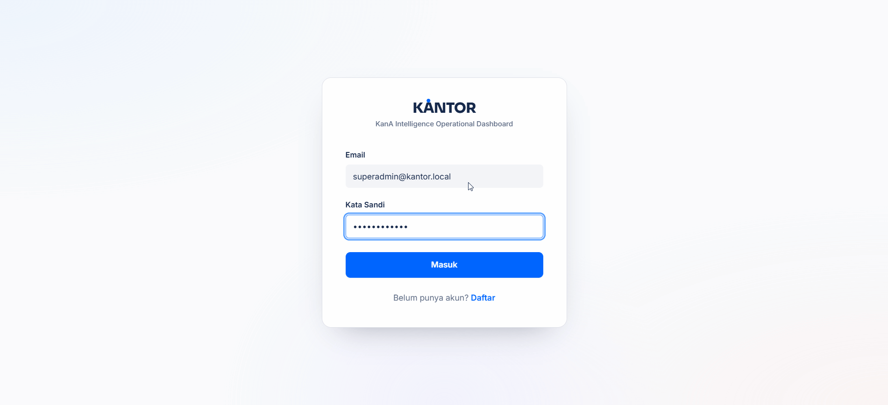
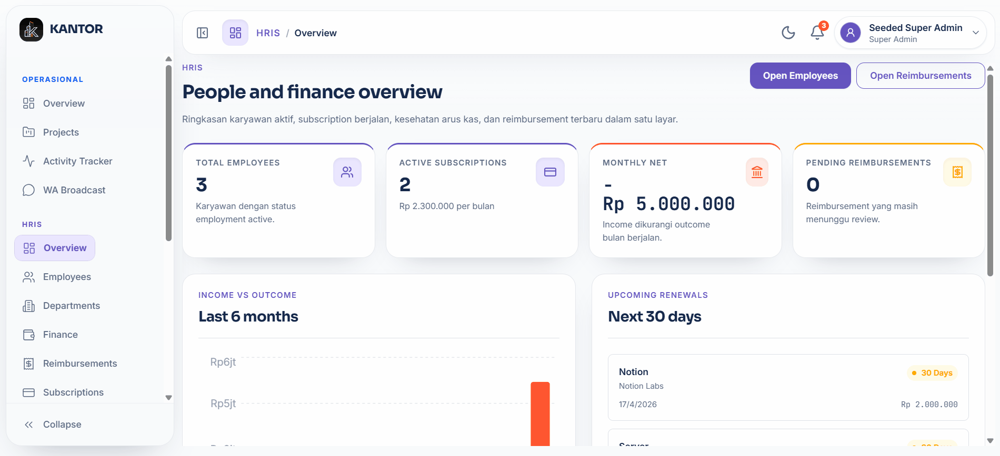

<div align="center">


### All-in-One Internal Company Platform

[](https://opensource.org/licenses/MIT)
[](https://go.dev/dl/)
[](https://react.dev/)
[](https://www.postgresql.org/)
[](https://www.docker.com/)

**KANTOR** is an open-source internal company platform that combines operational workflow, HRIS (Human Resources), and marketing management into a single unified application. Built for small to mid-size teams that need project management, employee data, finance tracking, and marketing campaigns — all in one place.

[Features](#features) &bull; [Demo](#demo) &bull; [Quick Start](#quick-start) &bull; [Documentation](#documentation) &bull; [Contributing](#contributing) &bull; [Custom Support](#custom-support)

</div>

---

## Demo

### Kanban Board & Project Management

<div align="center">
  
</div>

### Activity Tracker

<div align="center">
  
</div>

### HRIS — Employees & Finance

<div align="center">
  
</div>

### Marketing — Leads & Campaigns

<div align="center">
  
</div>

---

## Features

### Operational Module

- **Project Management** &mdash; Full CRUD with status, priority, timeline, and team member assignment
- **Kanban Board** &mdash; Drag-and-drop task management with customizable columns per project. Labels, priority, assignees, due dates, and real-time reordering
- **Auto-Assignment Rules** &mdash; Rule-based task assignment by department, skill, or current workload
- **Activity Tracker** &mdash; Chrome Extension (Manifest V3) with 30-second heartbeat, idle detection, domain categorization, and productivity scoring. Includes privacy consent workflow and offline queue
- **WhatsApp Broadcast** &mdash; Template-based messaging via [WAHA](https://waha.devlike.pro/), per-tenant WA settings, scheduled broadcasts, automated reminders (task due, overdue, weekly digest), DB-backed rate limiting, and delivery tracking

### HRIS Module

- **Employee Management** &mdash; Employee profiles, department structure, avatars, bank details, SSH keys, LinkedIn
- **Compensation** &mdash; Salary and bonus records with AES-256-GCM encryption at rest. Historical tracking with audit logging
- **Subscription Tracking** &mdash; Tool/service subscriptions with renewal alerts (H-30, H-7, H-1) and cost aggregation
- **Finance & Outcome** &mdash; Income and outcome tracking with customizable categories, approval workflow, 12-month trend analysis, and CSV/Excel export
- **Reimbursements** &mdash; Submission with receipt upload, approval workflow (submitted &rarr; approved/rejected &rarr; paid), attachment management

### Marketing Module

- **Campaign Kanban** &mdash; 6-column workflow: Ideation &rarr; Planning &rarr; In Production &rarr; Live &rarr; Completed &rarr; Archived
- **Ads Metrics** &mdash; Manual input with auto-calculated CPR, ROAS, CTR, CPC, CPM. Per-campaign comparison and platform trend analysis
- **Leads Pipeline** &mdash; Multi-channel lead tracking (WhatsApp, Email) with kanban pipeline visualization, bulk CSV import, and activity log per lead

### Foundation

- **Authentication** &mdash; JWT-based with access tokens (15m) + refresh tokens (7d). Account lockout after failed attempts
- **RBAC** &mdash; Granular role-based access control with module-scoped permissions (`module:resource:action`). 5 standard roles: super_admin, admin, manager, staff, viewer
- **Multi-Tenancy** &mdash; PostgreSQL Row-Level Security (RLS) with per-tenant data isolation. One database, multiple organizations, completely separated data
- **Notification Center** &mdash; In-app notifications with unread counters, SSE-based realtime updates, and browser notifications when the tab is inactive
- **Protected File Access** &mdash; Uploads are served through authenticated utility endpoints with permission and ownership checks
- **Audit Logging** &mdash; All state-changing operations logged for compliance and traceability
- **Data Encryption** &mdash; Sensitive data (salaries, bonuses) encrypted at rest with AES-256-GCM. Supports key rotation

---

## Tech Stack

| Layer           | Technology                                                       |
| --------------- | ---------------------------------------------------------------- |
| **Backend**     | Go 1.25, Chi router, pgx v5, golang-migrate                      |
| **Frontend**    | React 19, Vite, TanStack Router & Query, Tailwind CSS, shadcn/ui |
| **Database**    | PostgreSQL 16 with Row-Level Security                            |
| **State**       | Zustand (client), TanStack Query (server)                        |
| **Forms**       | React Hook Form + Zod validation                                 |
| **Charts**      | Recharts                                                         |
| **Export**      | excelize (Excel), gofpdf (PDF)                                   |
| **Drag & Drop** | @dnd-kit                                                         |
| **Extension**   | Chrome Manifest V3                                               |
| **Deployment**  | Docker Compose, nginx reverse proxy                              |

---

## Quick Start

### Prerequisites

- [Docker](https://docs.docker.com/get-docker/) Engine 24+ and Docker Compose v2
- [Git](https://git-scm.com/)

### 1. Clone the repository

```bash
git clone https://github.com/kana-consultant/kantor.git
cd kantor
```

### 2. Configure environment

```bash
cp .env.example .env
```

Edit `.env` and set your secrets. For local development, the defaults work out of the box.

### 3. Start the stack

```bash
docker compose up --build -d
```

### 4. Open the app

```
http://localhost:3000
```

Default credentials (when seed is enabled):

| Role             | Email                           | Password       |
| ---------------- | ------------------------------- | -------------- |
| Super Admin      | `superadmin@kantor.local`       | `Password123!` |
| Ops Staff        | `staff.ops@kantor.local`        | `Password123!` |
| Ops Viewer       | `viewer.ops@kantor.local`       | `Password123!` |
| Marketing Staff  | `staff.marketing@kantor.local`  | `Password123!` |
| Marketing Viewer | `viewer.marketing@kantor.local` | `Password123!` |

> **Note:** Disable seed users in production by setting `SEED_SUPERADMIN_ENABLED=false` and `SEED_DEMO_USERS_ENABLED=false`.

---

## Development

### Backend

```bash
cd backend
go build ./cmd/server
./server
```

Requires a running PostgreSQL instance. Set `DATABASE_URL` in your environment.

### Frontend

```bash
cd frontend
npm install
npm run dev
```

The dev server runs on `http://localhost:5173` and proxies API requests to the backend.

### Full Stack (Docker)

```bash
docker compose up --build -d

# View logs
docker compose logs -f backend

# Restart after code changes
docker compose up --build -d backend
```

---

## Project Structure

```
kantor/
├── backend/
│   ├── cmd/server/          # Application entry point
│   ├── internal/
│   │   ├── app/             # Router setup, initialization, background jobs
│   │   ├── auth/            # JWT generation & validation
│   │   ├── config/          # Environment & config loading
│   │   ├── handler/         # HTTP handlers (admin, auth, hris, marketing, operational, wa)
│   │   ├── middleware/      # Auth, RBAC, CORS, tenant, logging
│   │   ├── model/           # Data models
│   │   ├── repository/      # Database queries (clean SQL, no ORM)
│   │   ├── service/         # Business logic layer
│   │   ├── rbac/            # Role & permission seeding, caching
│   │   ├── tenant/          # Multi-tenancy resolver
│   │   ├── dto/             # Request/response DTOs
│   │   ├── security/        # AES-GCM encryption utilities
│   │   └── export/          # CSV/Excel export helpers
│   └── migrations/          # SQL migration files (up/down pairs)
├── frontend/
│   ├── src/
│   │   ├── routes/          # TanStack Router file-based routes
│   │   ├── components/      # UI components (ui/, shared/, layout/, providers/)
│   │   ├── hooks/           # Custom React hooks (useAuth, useRBAC, etc.)
│   │   ├── services/        # API client functions per module
│   │   ├── stores/          # Zustand stores (auth, sidebar)
│   │   ├── types/           # TypeScript interfaces
│   │   └── lib/             # Utilities, constants, API client
│   └── nginx.conf           # Reverse proxy config
├── extension/               # Chrome Extension (Manifest V3) for activity tracking
├── docs/                    # Documentation
├── docker-compose.yml       # Full stack orchestration
├── Dockerfile.backend       # Multi-stage Go build → Alpine
├── Dockerfile.frontend      # Node build → nginx:alpine
└── .env.example             # Environment variable template
```

### Architecture

```
Handler → Service → Repository → PostgreSQL (with RLS)
```

- **Handler**: HTTP request parsing, input validation, JSON responses
- **Service**: Business logic, orchestration, error handling
- **Repository**: Pure SQL queries via pgx — no ORM

RBAC is enforced at both the API middleware level and the frontend via permission gates.

---

## Configuration

### Environment Variables

See [`.env.example`](.env.example) for the full list. Key variables:

| Variable                 | Required | Description                                            |
| ------------------------ | -------- | ------------------------------------------------------ |
| `DATABASE_URL`           | Yes      | PostgreSQL connection string                           |
| `JWT_SECRET`             | Yes      | HMAC signing key for JWTs (min 32 chars in production) |
| `DATA_ENCRYPTION_KEY`    | Yes      | AES-256-GCM key for sensitive data encryption          |
| `CORS_ORIGINS`           | No       | Comma-separated allowed origins                        |
| `TENANTS`                | No       | Tenant definitions: `name\|slug\|domain1,domain2`      |
| `APP_URL`                | No       | Public base URL used for deep links in WA messages and notifications |
| `TRACKER_RETENTION_DAYS` | No       | Activity tracker data retention (default: 90)          |

WhatsApp runtime settings are no longer configured from environment variables.
WAHA endpoint, API key, session name, rate limits, and schedules are stored per tenant in `tenant_wa_configs` and managed from the WA Broadcast settings page.

### Multi-Tenancy

KANTOR supports multi-tenancy via PostgreSQL Row-Level Security. Each tenant is resolved from the `Host` header, and all data is automatically isolated.

```env
# Single tenant (default)
TENANTS=MyCompany|mycompany|localhost

# Multiple tenants
TENANTS=Company A|company-a|kantor.company-a.com;Company B|company-b|kantor.company-b.com
```

### Health Checks

| Endpoint       | Purpose                                    |
| -------------- | ------------------------------------------ |
| `GET /healthz` | Liveness check — always returns 200        |
| `GET /readyz`  | Readiness check — verifies DB connectivity |

---

## Documentation

| Document                               | Description                                                             |
| -------------------------------------- | ----------------------------------------------------------------------- |
| [Architecture Overview](docs/architecture.md) | Runtime architecture, multi-tenancy, notifications, extension, and WA integration |
| [Deployment Guide](docs/deployment.md) | Production deployment with Docker, TLS, backups, and security checklist |
| [QA Remediation & Tests](QA_REMEDIATION_AND_TESTS.md) | Summary of QA fixes and manual verification steps |
| [Contributing](CONTRIBUTING.md)        | Development setup, project rules, PR guidelines, and commit style       |
| [Security Policy](SECURITY.md)         | Vulnerability reporting instructions                                    |
| [Code of Conduct](CODE_OF_CONDUCT.md)  | Community standards (Contributor Covenant v2.1)                         |
| [License](LICENSE)                     | MIT License                                                             |

---

## Roadmap

- [x] Project management with kanban board
- [x] RBAC with module-scoped permissions
- [x] HRIS: employees, compensation (encrypted), departments
- [x] Finance tracking with approval workflow
- [x] Reimbursement system with attachments
- [x] Subscription tracking with renewal alerts
- [x] Marketing campaigns, ads metrics, leads pipeline
- [x] WhatsApp broadcast via WAHA
- [x] Chrome extension activity tracker
- [x] Audit logging
- [x] CSV/Excel export
- [x] Multi-tenancy with PostgreSQL RLS
- [x] Notification center (in-app + browser)
- [ ] Email notifications
- [ ] Dashboard analytics with custom widgets
- [ ] API documentation (OpenAPI/Swagger)
- [ ] Automated test suite
- [ ] Mobile responsive improvements
- [ ] Plugin/extension system

---

## Contributing

We welcome contributions! Please read [CONTRIBUTING.md](CONTRIBUTING.md) before opening a pull request.

```bash
# Fork and clone
git clone https://github.com/<your-username>/kantor.git
cd kantor

# Start the dev environment
cp .env.example .env
docker compose up --build -d

# Make changes, test, and submit a PR
```

### Contribution Areas

- **Bug Fixes** &mdash; Report and fix issues
- **New Features** &mdash; Propose and implement new modules or enhancements
- **Documentation** &mdash; Improve guides, add examples, translate
- **UI/UX** &mdash; Design improvements, accessibility, mobile responsiveness
- **Testing** &mdash; Add unit tests, integration tests, E2E tests
- **Translations** &mdash; Localization support

---

## Custom Support

Need help with deployment, customization, or extending KANTOR for your organization? We offer custom support for:

- **WhatsApp Integration** &mdash; Custom WAHA setup, automated workflows, multi-session WhatsApp broadcast
- **Activity Tracker** &mdash; Custom Chrome extension deployment, domain categorization, productivity reporting
- **Multi-Tenancy Setup** &mdash; Domain configuration, tenant onboarding, data migration
- **Custom Modules** &mdash; Build new features tailored to your business needs
- **Deployment & Infrastructure** &mdash; Production setup, CI/CD pipeline, monitoring

### Contact Us

Reach out via WhatsApp for inquiries:

**PERFECT10 Official** &mdash; [Chat on WhatsApp](https://wa.me/628216957827?text=Hai%20saya%20...%2C%20dari%20...%2C%20mau%20informasi%20lebih%20lanjut%20tentang%20custom%20support%20dari%20KANTOR)

> Template message:
>
> ```
> Hai saya ..., dari ..., mau informasi lebih lanjut tentang custom support dari KANTOR
> ```

---

## License

This project is licensed under the MIT License &mdash; see the [LICENSE](LICENSE) file for details.

---

## Acknowledgments

- [Go](https://go.dev/) &mdash; Backend runtime
- [React](https://react.dev/) &mdash; Frontend framework
- [TanStack](https://tanstack.com/) &mdash; Router & Query
- [PostgreSQL](https://www.postgresql.org/) &mdash; Database with RLS
- [shadcn/ui](https://ui.shadcn.com/) &mdash; UI component library
- [Tailwind CSS](https://tailwindcss.com/) &mdash; Utility-first CSS
- [WAHA](https://waha.devlike.pro/) &mdash; WhatsApp HTTP API
- [@dnd-kit](https://dndkit.com/) &mdash; Drag and drop
- [Recharts](https://recharts.org/) &mdash; Charts and data visualization

---

<div align="center">

**KANTOR** &mdash; Operational. HRIS. Marketing. All in one.

Made with care by [PERFECT10](https://perfect10.bot)

[Back to Top](#kantor)

</div>
